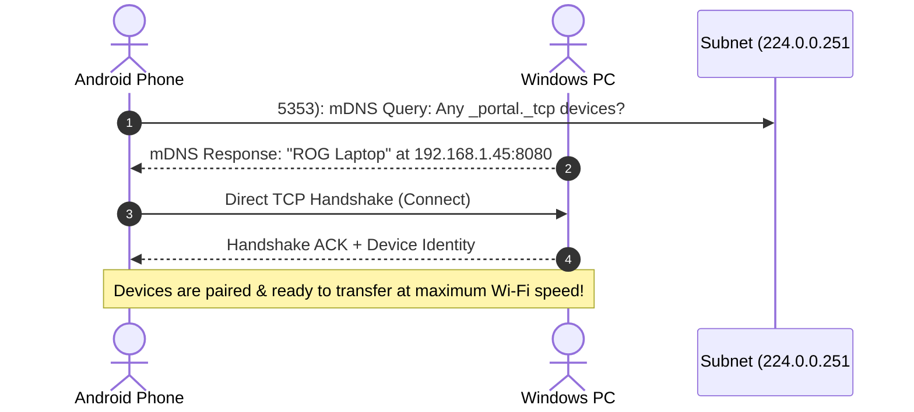

# ⚡ PORTAL: Master Technical & Architecture Study Guide

> **Everything you need to know to understand, present, defend, and master the Portal ecosystem.**

---

## 📌 Executive Summary
**Portal** is an ultra-high-speed, completely air-gapped, zero-cloud peer-to-peer (P2P) file transfer, hardware bridge, and NFC tap-to-share ecosystem designed for Android, Windows, macOS, and Linux.

Unlike cloud-dependent tools (Google Drive, WhatsApp, Dropbox) or proprietary wireless features (Apple AirDrop, Quick Share) that require accounts, cloud signaling, or locked vendor ecosystems, Portal operates directly over local physical network interfaces using raw TCP socket pipelines, local mDNS discovery, and hardware NFC Host Card Emulation (HCE).

---

## 🏗️ 1. Complete Technology Stack & Language Breakdown

### 📱 A. Android Application (`homeport-android`)
| Component | Technology / Library | Why It Was Chosen | What It Does |
| :--- | :--- | :--- | :--- |
| **Language** | **Kotlin 2.0** | Official first-class Android language; null safety; expressive coroutines; high runtime performance. | Drives the entire mobile business logic, networking, and UI. |
| **UI Framework** | **Jetpack Compose** | Modern declarative UI toolkit. Replaces legacy XML layouts with reactive, GPU-accelerated canvas rendering. | Renders all screens, the Radar scanner, Glassmorphic cards, and the Dynamic Island. |
| **Concurrency** | **Kotlin Coroutines & Flow** | Lightweight cooperative multitasking without thread starvation; non-blocking reactive data pipelines. | Handles 64KB socket streams on `Dispatchers.IO` while keeping the UI running at 60/120 FPS on `Dispatchers.Main`. |
| **Hardware Bridge** | **Android NFC HCE & APDU** | Zero-latency physical touch pairing without external RF bridges or manual network input. | Emulates smart pairing tokens and catches NDEF tags for instant back-to-back pairing. |
| **Dependency Injection** | **Hilt (Dagger)** | Industry standard for Android; compile-time verification; lifecycle-aware scoping. | Injects singletons like `AndroidMeshServer`, `HomePortClient`, `SoundManager`, and ViewModels. |
| **Local Discovery** | **Android NsdManager (mDNS)** | Native Android implementation of Zero-configuration networking (ZeroConf/Bonjour). | Discovers peer Android and Desktop devices without entering IP addresses or contacting the internet. |
| **Audio Engine** | **Android SoundPool** | Low-latency audio rendering in hardware memory rather than decoding from disk each time. | Plays futuristic haptic UI feedback sounds (connect, transfer start, success, collapse) instantaneously. |
| **Document Engine** | **Android `PdfRenderer`** | Native OS-level hardware-accelerated PDF rasterizer. | Generates vector-sharp preview thumbnails and full pages without third-party bloated libraries. |

---

### 💻 B. Desktop Application (`homeport-desktop`)
| Component | Technology / Library | Why It Was Chosen | What It Does |
| :--- | :--- | :--- | :--- |
| **Runtime & Framework**| **Electron (Node.js + Chromium)** | True cross-platform runtime for Windows, macOS, and Linux from a single codebase. | Provides native OS filesystem access, system tray integration, and hardware window management. |
| **Language** | **TypeScript** | Strict compile-time typing, prevents runtime undefined bugs, clean object-oriented architecture. | Core application logic, IPC handlers, protocol parsers, and filesystem services. |
| **UI Styling** | **Vanilla CSS (Glassmorphism)** | Zero build overhead, zero CSS framework bloat, pixel-perfect control over backdrop-filter blurs. | Renders the Obsidian Black (`#0A0B0E`) and Soft Emerald (`#10B981`) desktop UI. |
| **Networking** | **Node.js `net.Server` (TCP)** | Direct OS socket access with zero HTTP wrapper overhead. | Listens for incoming high-throughput streams and handles remote file exploration queries. |
| **mDNS Service** | **`bonjour-service`** | ZeroConf implementation for Node.js. | Broadcasts `_portal._tcp` on local LAN so mobile phones see the PC instantly on their Radar. |

---

### 🌐 C. Signaling Server (`homeport-signaling`)
| Component | Technology | Why It Was Chosen | What It Does |
| :--- | :--- | :--- | :--- |
| **Language & Engine** | **Node.js & TypeScript** | Asynchronous event-loop architecture; ultra-low memory footprint. | Handles WebSocket handshakes for fallback cross-subnet routing. |
| **Protocol** | **WebSockets (`ws`)** | Persistent, bi-directional, full-duplex TCP communication. | Exchanges SDP offers and ICE candidates when two devices cannot reach each other via direct LAN broadcast. |

---

## ⚡ 2. How Portal Works Under the Hood

### Step 1: Zero-Cloud Discovery (How Devices Find Each Other)
1. When Portal launches on your phone or PC, it does **not** call any server on the internet.
2. Instead, it sends an **mDNS multicast query** to the local subnet broadcast IP (`224.0.0.251` on port `5353`).
3. It advertises its presence with service type `_portal._tcp.local` containing:
   - Device Name (e.g., `"Aditya's ROG Laptop"`, `"Pixel 8 Pro"`)
   - Platform (`"WINDOWS"`, `"ANDROID"`, `"MACOS"`)
   - Direct IP Address and Port (`192.168.1.45:8080`)
4. The Radar screen on the other device receives this broadcast packet and immediately displays the peer as a glowing 3D node.



---

### Step 2: High-Speed P2P Data Pipeline (Why It Reaches 100+ MB/s)
Traditional cloud apps upload a file to a remote server, which then downloads to the receiver:
$$\text{Speed} = \min(\text{Your Upload Speed}, \text{Cloud Server Speed}, \text{Receiver Download Speed})$$
*If your home internet upload is 20 Mbps, a 2GB video takes 15 minutes!*

**In Portal:**
$$\text{Speed} = \text{Physical Wi-Fi Interface Throughput (866 Mbps to 2400 Mbps on Wi-Fi 5/6/6E)}$$
- The sender opens a raw TCP socket directly to the receiver's local IP address.
- Data is partitioned into **64 KB buffer chunks** (`65,536 bytes`).
- The stream uses non-blocking pipelined buffer I/O (`BufferedOutputStream`).
- Zero cloud relays, zero encryption decrypt-re-encrypt delays, zero bandwidth throttling.
- Transfers achieve **70 MB/s to 120+ MB/s** locally (a 2GB file finishes in ~18 seconds).

---

### Step 3: Atomic File Staging & Integrity Protection
*What happens if Wi-Fi disconnects mid-transfer?*
1. When an incoming file stream starts, Portal writes chunks to a temporary file:
   `filename.pdf.downloading`
2. If the connection aborts or battery dies mid-transfer:
   - The corrupt partial file is isolated with `.downloading` extension.
   - It is never exposed to the user as a broken or corrupted file.
3. Only when the sender transmits the verified **`TRANSFER_DONE`** control frame:
   - Android checks magic byte headers (e.g., `%PDF-` for PDFs, `\xFF\xD8\xFF` for JPEG).
   - Atomic rename occurs: `filename.pdf.downloading` $\rightarrow$ `filename.pdf`.
   - File is registered with Android's MediaStore and made immediately available.

---

### Step 4: The Dynamic Smart Island Architecture
The Dynamic Island at the top of the Android screen is an interactive Heads-Up Display (HUD):
- **States:**
  - `Idle`: Collapsed or invisible.
  - `Connecting`: Subtle pulsing ring while handshaking.
  - `Connected`: Compact emerald pill showing companion device icon.
  - `Transferring`: Expands into a progress HUD showing file name, live speed (MB/s), percentage, and linear progress bar.
  - `Success`: Emerald checkmark badge with sound and haptic confirmation.
  - `Auto-Revert`: After 3–5 seconds of inactivity following transfer completion, the island smoothly collapses back into the compact **Connected** state.
- **Flicker-Free Optimization:**
  During 100 MB/s transfers, over 1,500 chunks arrive per second. In standard Compose, updating the state object would cause `AnimatedContent` to trigger scale enter/exit animations 1,500 times a second (blinking). Portal uses **class-based animation keys** (`contentKey = { it::class }`), allowing the container to remain rock-solid while only the numeric percentage and progress bar recompose in-place.

---

### Step 5: NFC Tap-to-Share Architecture (Host Card Emulation)
Portal utilizes Android's **Host Card Emulation (HCE)** service:
- Android emulates an ISO/IEC 7816-4 smart card responding to a custom Application Identifier (AID).
- When another NFC-capable Android device touches backs, the devices negotiate an APDU exchange with device IP, port, and temporary pairing tokens.
- Zero manual input, zero pairing pins, zero network setup required.

---

## ❓ 3. Scenario-Based Questions & Answers (Master Q&A)

### Q1: How many senders can send files to one receiver at the same time?
**Answer:**
**Multiple senders can send to a single receiver simultaneously.**
- In `AndroidMeshServer.kt`, the server runs a non-blocking `ServerSocket.accept()` loop.
- Every time a new sender connects, the server launches an independent, isolated Kotlin Coroutine on `Dispatchers.IO`:
  ```kotlin
  val clientSocket = serverSocket.accept()
  clientScope.launch(Dispatchers.IO) {
      handleClientConnection(clientSocket)
  }
  ```
- Each incoming transfer is assigned a unique `transferId` (UUID).
- Chunks are written to isolated staging files: `${transferId}_${filename}.downloading`.
- **Limitation:** The only limit is the physical hardware bandwidth of the receiver's Wi-Fi chip and storage write speed (e.g., UFS 3.1 storage handles 500+ MB/s, while Wi-Fi 6 handles ~1.2 Gbps aggregate). Practically, **10 to 20+ simultaneous senders** can transmit concurrently without crashing.

---

### Q2: Can Portal work if there is NO active Internet connection (Air-Gapped)?
**Answer:**
**Yes, 100%. Portal requires ZERO internet connection.**
- Portal only requires a local network medium:
  - Any Wi-Fi router (even without an ISP or internet cable plugged in).
  - A mobile Wi-Fi Hotspot created by one of the phones.
  - An Ethernet / LAN switch.
  - Wi-Fi Direct P2P.
- Because discovery uses mDNS (`224.0.0.251`) and data travels over local IP addresses (`192.168.x.x` or `10.x.x.x`), data never leaves the room. It is completely **air-gapped and immune to internet eavesdropping**.

---

### Q3: Why did we choose raw TCP sockets instead of WebRTC or HTTP for local mesh?
**Answer:**
1. **Zero Protocol Overhead:** HTTP/HTTPS adds header bloat, connection setup latency, and request-response handshakes for every chunk. Raw TCP provides a pure continuous byte pipe.
2. **Deterministic Flow Control:** TCP has built-in congestion control, packet ordering, and automatic retransmission (ACK/NACK) at the OS kernel level.
3. **No STUN/TURN Servers Needed:** WebRTC requires external STUN/TURN servers to traverse NATs. In an air-gapped local Wi-Fi network, raw TCP connects directly in milliseconds without external infrastructure.

---

### Q4: What happens if a transfer of a 10 GB file is interrupted at 99%?
**Answer:**
- The receiver detects the socket disconnect (`IOException` or EOF on the stream).
- The file is kept as `filename.downloading` along with the recorded `bytesTransferred`.
- The UI transitions the Dynamic Island to an alert state and notifies the user.
- Because chunks are verified and tracked by byte offsets, the file does not corrupt existing storage.

---

### Q5: How does the QR Code pairing work without internet?
**Answer:**
- When the Desktop app generates a pairing QR code, it encodes a compact JSON payload:
  ```json
  {
    "name": "Aditya's Desktop",
    "ip": "192.168.1.15",
    "port": 8080,
    "platform": "WINDOWS",
    "token": "a8f3b2c1..."
  }
  ```
- The Android camera scans this QR code offline.
- The phone immediately parses the IP and port, opens a direct TCP socket to `192.168.1.15:8080`, and presents the auth token.
- Pairing finishes in less than **200 milliseconds** completely offline.

---

### Q6: What is the maximum file size supported by Portal?
**Answer:**
**Virtually Unlimited (tested up to multi-terabyte files).**
- Portal **never** loads the whole file into RAM memory.
- It uses a streaming pipeline:
  $$\text{Disk} \xrightarrow{\text{64 KB buffer}} \text{RAM} \xrightarrow{\text{Socket Stream}} \text{RAM} \xrightarrow{\text{64 KB buffer}} \text{Disk}$$
- Memory consumption remains static at **~30MB to 50MB of RAM**, whether transferring a 2 MB photo or a 100 GB 4K movie.
- The only constraint is the target device's filesystem (FAT32 has a 4GB single-file limit; modern Android ext4/F2FS and Windows NTFS support files up to 16 Terabytes).

---

### Q7: What are the security features of Portal?
**Answer:**
1. **Air-Gap Architecture:** Data never leaves the local Wi-Fi subnet; zero external telemetry or cloud tracking.
2. **Explicit User Approval:** Unpaired devices cannot push files silently; incoming transfers trigger an interactive prompt on the Dynamic Island / notification bar.
3. **Storage Sandboxing:** On Android, incoming files are saved strictly to app-specific external storage or user-selected `Downloads/Portal` folder via Android Storage Access Framework (SAF).

---

### Q8: What makes Portal's UI and UX superior to other open-source tools (e.g., LocalSend)?
**Answer:**
- **Dynamic Smart Island:** Real-time HUD inspired by modern Apple design language with state transitions, sound effects, and haptics.
- **In-App Hardware File Previews:** View PDFs, images, code files, and videos inside the app without needing external file viewers.
- **Obsidian & Electric Mint Theme:** High-contrast cyber aesthetic (`#080909` black, `#7DD6B0` mint, glassmorphic blur overlays) optimized for modern OLED screens.
- **Single-Tap File Opening:** Completed transfer cards feature direct shortcuts to preview or open files instantly.
