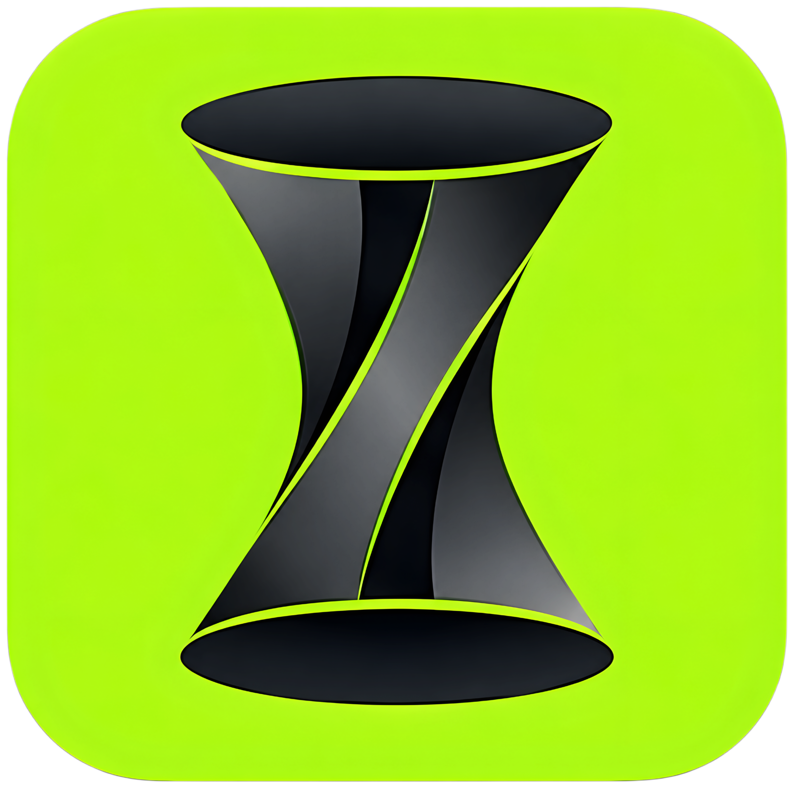
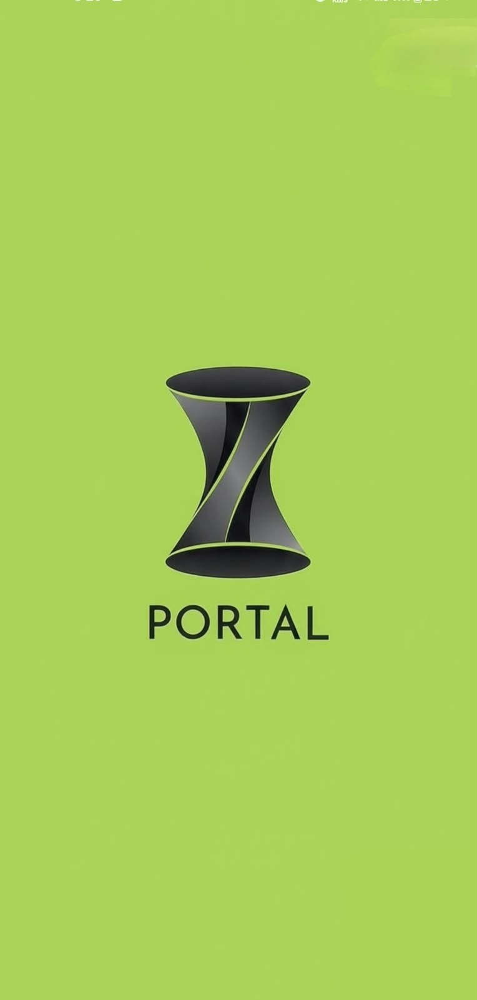
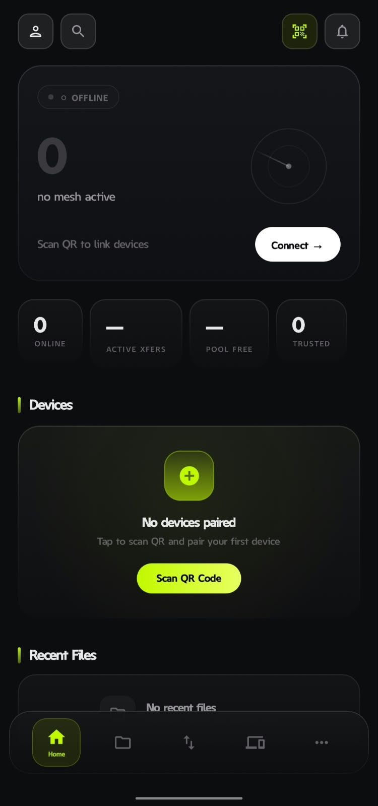
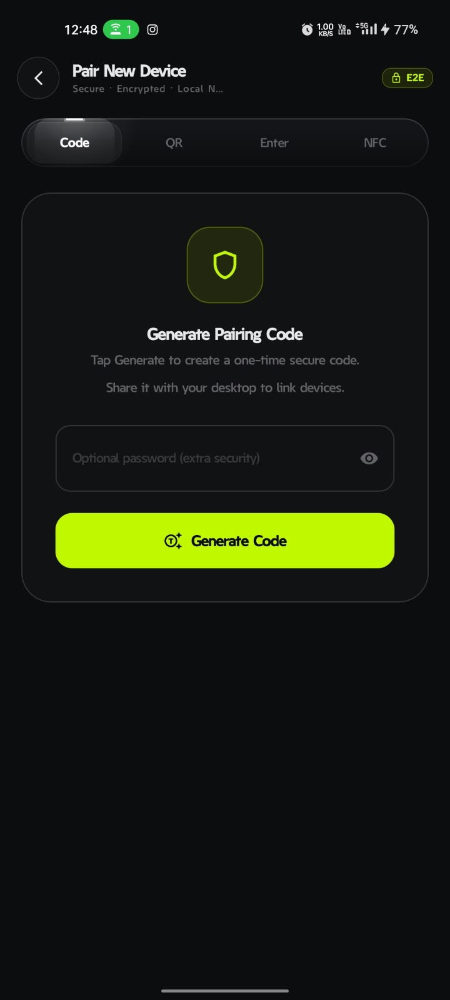
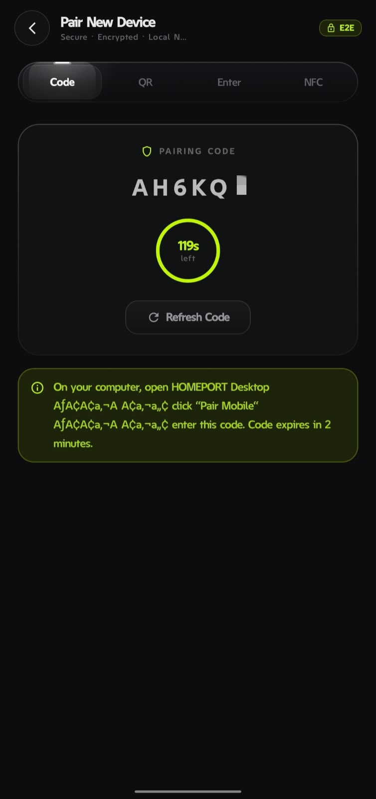
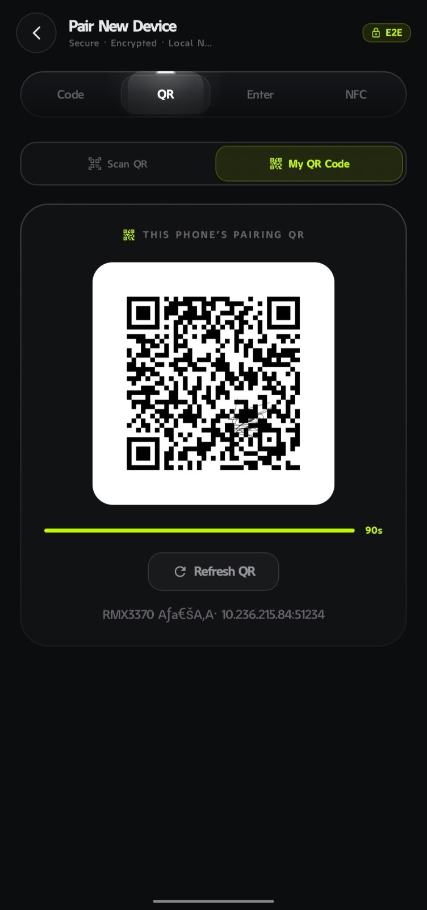
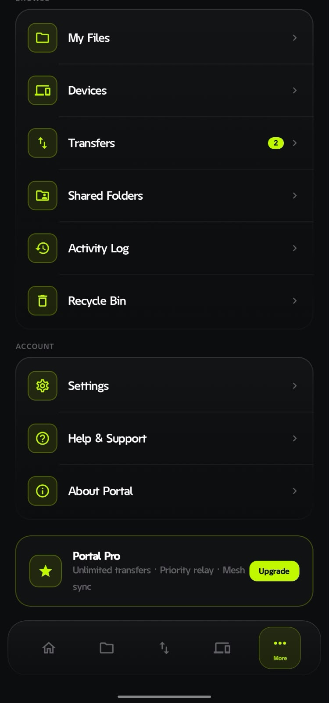
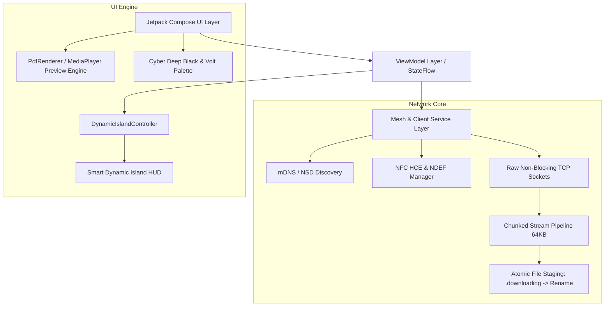

<p align="center">
  
</p>

<h1 align="center">PORTAL</h1>

<p align="center">
  <b>Zero-Cloud, High-Speed Hardware Bridge & Local Mesh File Transfer Ecosystem for Android & Desktop</b>
</p>

<p align="center">
  <a href="https://developer.android.com"></a>
  <a href="https://www.electronjs.org"></a>
  <a href="https://kotlinlang.org"></a>
  <a href="https://developer.android.com/jetpack/compose"></a>
  <a href="https://en.wikipedia.org/wiki/Air_gap_(networking)"></a>
  
  <a href="Portal.apk"></a>
</p>

---

## 📖 Table of Contents
- [Overview](#-overview)
- [Application Showcase](#-application-showcase)
- [Project Objectives](#-project-objectives)
- [Core Features](#-core-features)
- [Dynamic Smart Island](#-dynamic-smart-island)
- [Technical Architecture](#-technical-architecture)
- [Key Challenges & Engineering Solutions](#-key-challenges--engineering-solutions)
- [Project Structure](#-project-structure)
- [Getting Started & Build Guide](#-getting-started--build-guide)
- [Design Language & Brand Identity](#-design-language--brand-identity)

---

## 🌟 Overview

**Portal** is an ultra-fast, completely air-gapped cross-device file sharing and synchronization platform engineered specifically for local networks and hardware bridges. By establishing direct peer-to-peer TCP streams over Wi-Fi, local mesh configurations, and instant NFC touch handshakes, Portal eliminates cloud servers, file size ceilings, bandwidth throttling, and privacy vulnerabilities.

Built from the ground up using **Kotlin** and **100% Jetpack Compose** on Android, paired with an **Electron & TypeScript** desktop hub, Portal unites raw hardware-level throughput with a cyber aesthetic featuring fluid interactive Dynamic Islands, ambient haptics, and live progress indicators.

---

## 📱 Application Showcase

<div align="center">

| **01. Brand Splash Screen** | **02. Home Dashboard & HUD** | **03. Pairing Code Setup** |
| :---: | :---: | :---: |
| <a href="docs/screenshots/01_splash_screen.jpg"></a> | <a href="docs/screenshots/02_home_dashboard.jpg"></a> | <a href="docs/screenshots/03_pairing_code_generate.jpg"></a> |
| *Minimalist hourglass identity & launch canvas* | *Speedometer gauge, mesh telemetry & quick scan* | *One-time secure token creation with optional password* |

<br />

| **04. Active 6-Digit Code** | **05. Dynamic QR Pairing** | **06. System & Navigation Hub** |
| :---: | :---: | :---: |
| <a href="docs/screenshots/04_pairing_code_active.jpg"></a> | <a href="docs/screenshots/05_pairing_qr_code.jpg"></a> | <a href="docs/screenshots/06_navigation_more_menu.jpg"></a> |
| *Live 120s circular countdown with auto-refresh* | *End-to-end encrypted QR with local socket telemetry* | *Transfers badge (2), shared folders & device settings* |

</div>

---

## 🎯 Project Objectives

1. **True Air-Gapped Privacy**: Guarantee that zero bytes of user data, metadata, or telemetry ever traverse external cloud services or third-party relays.
2. **Maximum Local Bandwidth Utilization**: Saturate available local Wi-Fi 5/6/6E bandwidth with chunked pipeline streaming, reaching sustainable transfer rates upwards of **100+ MB/s**.
3. **Zero Configuration Friction**: Facilitate instant hardware-to-hardware discovery via mDNS / Network Service Discovery (NSD), quick NFC tap-to-pair, and cryptographic QR pairing.
4. **State-of-the-Art UX**: Deliver a futuristic, responsive mobile experience powered by custom Dynamic Island HUDs, hardware-accelerated document previewers, and procedural sound design.

---

## ⚡ Core Features

### 📡 High-Speed Local Mesh Network
- **Zero-Cloud Discovery**: Uses local mDNS/NSD service broadcasts to detect nearby Desktop and Android companions in milliseconds.
- **Direct P2P Sockets**: Raw non-blocking TCP socket engine with full 64KB pipelined buffer streaming for maximum IO efficiency.
- **Bi-Directional Transfer**: Seamlessly send and receive individual files, batches, documents, or entire media folders between any paired hardware.

### 📲 NFC Tap-to-Share & Instant Handshake
- **Host Card Emulation (HCE)**: Custom APDU service enabling Android devices to emulate smart pairing tokens.
- **NDEF & Beam-Free Pairing**: Instant connection establishment simply by holding two devices back-to-back.
- **Auto-Launch from Cold Start**: Automatically opens Portal and begins transferring immediately upon physical contact.

### 🏝️ Dynamic Smart Island (HUD)
- **Fluid Morphing States**: Adapts seamlessly between **Idle**, **Connecting**, **Connected**, **Transferring**, and **Success** states.
- **Real-Time Progress & Speed**: Live percentage tracking, animated progress ring, instantaneous transfer throughput (MB/s), and remaining time estimation.
- **Smart Reversion**: Automatically collapses into a compact connected badge after activity completes, confirming ongoing mesh link health.

### 📄 Universal File Preview Engine
- **In-App PDF Reader**: High-fidelity PDF rendering using Android's native `PdfRenderer`, with page-by-page caching, hardware-accelerated canvas fills, and `%PDF-` magic header verification.
- **Multimedia Viewer**: Fluid image inspection with gestures and high-bitrate video playback.
- **Instant Quick Actions**: Single-tap file opening shortcuts, system share intent dispatcher, and local file path copy shortcuts.

### ⚡ Transfers Management Hub
- **Dedicated Transfers Screen**: Chronological categorization of active, queued, and historical uploads/downloads.
- **One-Tap Open Shortcut**: Completed cards feature an immediate emerald **Open** button to preview or open files directly without digging through file managers.
- **Batch Transfer Resiliency**: Support for multiple concurrent files with individual progress and cumulative throughput metrics.

---

## 🛠️ Technical Architecture



### Tech Stack
| Component | Technology |
|---|---|
| **Language (Android)** | Kotlin 2.0+ (Coroutines, StateFlow, Channels) |
| **Language (Desktop)** | TypeScript / Node.js (Electron runtime) |
| **UI Framework (Android)** | Jetpack Compose (Material 3, Custom Canvas Shaders) |
| **UI Framework (Desktop)** | Obsidian Dark Glassmorphism (Vanilla CSS, Hardware-accelerated) |
| **Dependency Injection** | Hilt / Dagger |
| **Networking** | Java NIO / TCP Sockets, Android NSD (Network Service Discovery), WebSockets |
| **Hardware Bridge** | Android NFC HCE (Host Card Emulation), APDU protocols |
| **Document Rendering** | Android `PdfRenderer` + Hardware Bitmap Canvas |
| **Audio & SFX** | Android `SoundPool` with custom haptic & procedural cues |
| **Minimum SDK** | Android 8.0 (API Level 26) |
| **Target SDK** | Android 15 (API Level 35) |

---

## 🧠 Key Challenges & Engineering Solutions

### 1. Dynamic Island High-Frequency Flicker
* **The Problem**: During 100+ MB/s transfers, incoming 64KB chunks updated progress several hundred times per second. Evaluating the entire transfer data class triggered exit/enter scale transitions, causing rapid blinking of the island.
* **The Solution**: Redesigned the transition keys to depend strictly on state classes (`DynamicIslandState::class`), isolating the high-frequency progress value to in-place linear progress recomposition without container re-inflation.

### 2. Incomplete PDF Streams & Header Corruption
* **The Problem**: Large PDF downloads occasionally triggered preview errors when opened immediately after transfer completion due to socket buffer exhaustion and partial write operations.
* **The Solution**: 
  1. Enforced a full-chunk buffer accumulation loop in `AndroidMeshServer.kt` and `HomePortClient.kt`.
  2. Implemented atomic file staging: chunks are written to a temporary `.downloading` file and only renamed to the final destination upon receiving verified `TRANSFER_DONE` frames.
  3. Added `%PDF-` magic byte validation before invoking `PdfRenderer`.

### 3. Smooth Screen Navigation & Stale Backstack State
* **The Problem**: Navigating directly between tabs failed when using standard Compose backstack saving (`saveState = true`), restoring stale peer IDs.
* **The Solution**: Streamlined tab navigation in `Navigation.kt` with `launchSingleTop = true` and dynamic mesh peer fallback resolution, enabling instant switching across all tabs under any mesh state.

### 4. Background Mesh Lifecycle & Battery Exemption
* **The Problem**: Aggressive OEM battery managers on Android 11+ killed background P2P mesh sockets when the phone screen turned off.
* **The Solution**: Integrated a persistent `MeshForegroundService` with notification channels, wake locks, and automated prompts for `REQUEST_IGNORE_BATTERY_OPTIMIZATIONS`.

---

## 📁 Project Structure

```
HOMEPORT/
├── Portal.apk                # Pre-compiled production release APK
├── portal_logo.png           # Official brand logo
├── docs/screenshots/         # High-resolution production application screenshots
├── homeport-android/         # Android Native Jetpack Compose App
│   ├── app/
│   │   ├── src/main/java/com/homeport/app/
│   │   │   ├── domain/model/     # Domain data models & transfer states
│   │   │   ├── di/               # Hilt dependency injection modules
│   │   │   ├── network/          # TCP sockets, NFC HCE, MeshForegroundService
│   │   │   ├── ui/
│   │   │   │   ├── components/   # Smart Dynamic Island, Glassmorphic cards
│   │   │   │   ├── screens/      # Home, Devices, Transfers, More, Onboarding
│   │   │   │   └── theme/        # Deep dark cyber palette & typography
│   │   │   └── res/              # 60fps video intro, APDU XML, vector drawables
├── homeport-desktop/         # Electron & TypeScript Desktop Hub
│   ├── src/
│   │   ├── main/             # Main process, P2P server, Bonjour mDNS, IPC
│   │   └── renderer/         # Dashboard, File explorer, Transfers, Settings
│   └── assets/               # Desktop app icons (.ico, .png)
└── homeport-signaling/       # Lightweight WebRTC fallback signaling relay
```

---

## 🚀 Getting Started & Build Guide

### Prerequisites
- Android Studio Ladybug (2024.2+) or later
- Node.js 18+ & npm
- JDK 17 or higher
- Android SDK (API 35 installed)

### 📱 Android Application
```bash
cd homeport-android

# Assemble debug binary
./gradlew assembleDebug

# Output APK location:
# app/build/outputs/apk/debug/app-debug.apk
```
Or directly install the pre-compiled [`Portal.apk`](Portal.apk).

### 💻 Desktop Application
```bash
cd homeport-desktop

# Install dependencies
npm install

# Build TypeScript and start Electron
npm start
```

---

## 🎨 Design Language & Brand Identity

* **Primary Contrast**: Deep Obsidian Black (`#080909`)
* **Signature Accent**: Electric Mint Green (`#7DD6B0` / `#A5F0D0`)
* **Secondary Surface**: Graphite Frosted Glass (`rgba(18,21,22,0.85)`)
* **Action Tones**: Soft Emerald (`#34C759`) for completed tasks, Pure White (`#FFFFFF`) for primary call-to-actions.
* **Design Philosophy**: Minimalist, hardware-centric, zero-clutter, information-dense.
