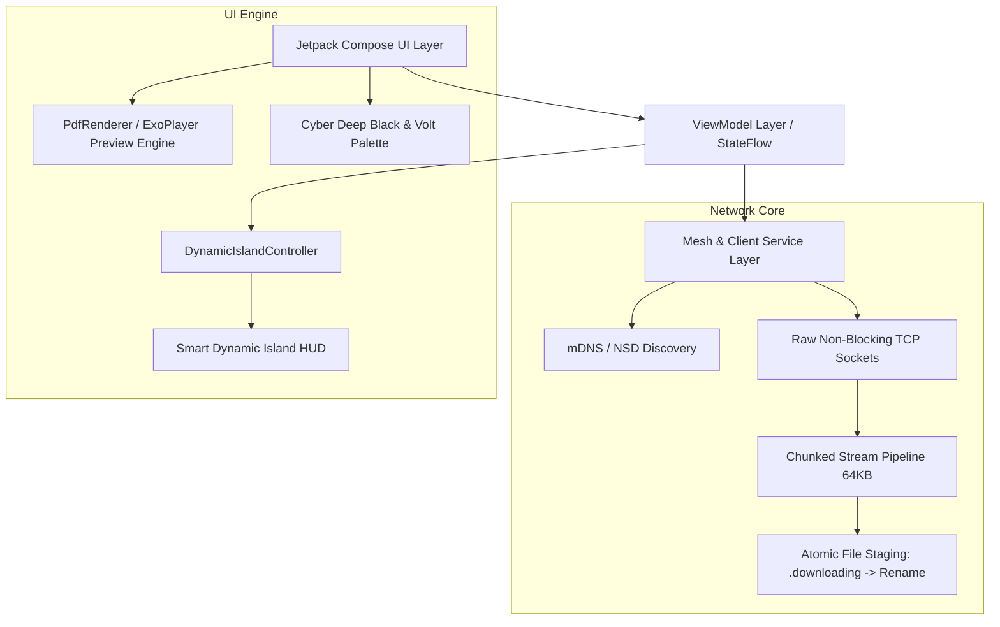

# ⚡ DESKWARD (formerly HomePort)

> **Zero-Cloud, High-Speed Hardware Bridge & Local Mesh File Transfer Ecosystem for Android & Desktop**

[-green?style=flat-square&logo=android)](https://developer.android.com)
[](https://kotlinlang.org)
[](https://developer.android.com/jetpack/compose)
[](https://en.wikipedia.org/wiki/Air_gap_(networking))
[](https://github.com)

---

## 📖 Table of Contents
- [Overview](#-overview)
- [Project Objectives](#-project-objectives)
- [Core Features](#-core-features)
- [Dynamic Smart Island](#-dynamic-smart-island)
- [Technical Architecture](#-technical-architecture)
- [Key Challenges & Engineering Solutions](#-key-challenges--engineering-solutions)
- [Project Structure](#-project-structure)
- [Getting Started & Build Guide](#-getting-started--build-guide)
- [Design Language & Brand Identity](#-design-language--brand-identity)

---

## 🌟 Overview

**Deskward** is an ultra-fast, completely air-gapped cross-device file sharing and synchronization platform engineered specifically for local networks. By establishing direct peer-to-peer TCP streams over Wi-Fi and local mesh configurations, Deskward eliminates cloud servers, file size ceilings, bandwidth throttling, and privacy vulnerabilities.

Built from the ground up using **Kotlin** and **100% Jetpack Compose**, Deskward pairs raw hardware-level throughput with an Apple-grade cyber aesthetic featuring dynamic interactive pills, ambient haptics, and live progress indicators.

---

## 🎯 Project Objectives

1. **True Air-Gapped Privacy**: Guarantee that zero bytes of user data, metadata, or telemetry ever traverse external cloud services or third-party relays.
2. **Maximum Local Bandwidth Utilization**: Saturate available local Wi-Fi 5/6/6E bandwidth with chunked pipeline streaming, reaching sustainable transfer rates upwards of **100+ MB/s**.
3. **Zero Configuration Friction**: Facilitate instant hardware-to-hardware discovery via mDNS / Network Service Discovery (NSD) and quick cryptographic QR pairing.
4. **State-of-the-Art UX**: Deliver a futuristic, responsive mobile experience powered by custom Dynamic Island HUDs, hardware-accelerated document previewers, and procedural sound design.

---

## ⚡ Core Features

### 📡 High-Speed Local Mesh Network
- **Zero-Cloud Discovery**: Uses local mDNS/NSD service broadcasts to detect nearby Desktop and Android companions in milliseconds.
- **Direct P2P Sockets**: Raw non-blocking TCP socket engine with full 64KB pipelined buffer streaming for maximum IO efficiency.
- **Bi-Directional Transfer**: Seamlessly send and receive individual files, batches, documents, or entire media folders between any paired hardware.

### 🏝️ Dynamic Smart Island (HUD)
- **Fluid Morphing States**: Adapts seamlessly between **Idle**, **Connecting**, **Connected**, **Transferring**, and **Success** states.
- **Real-Time Progress & Speed**: Live percentage tracking, animated progress ring, instantaneous transfer throughput (MB/s), and remaining time estimation.
- **Smart Reversion**: Automatically collapses into a compact connected badge after 3–5 seconds of completed activity, confirming ongoing mesh link health.

### 📄 Universal File Preview Engine
- **In-App PDF Reader**: High-fidelity PDF rendering using Android's native `PdfRenderer`, with page-by-page caching, hardware-accelerated canvas fills, and `%PDF-` magic header verification.
- **Multimedia Viewer**: Fluid image inspection with gestures and high-bitrate video playback.
- **Instant Quick Actions**: Single-tap file opening shortcuts, system share intent dispatcher, and local file path copy shortcuts.

### ⚡ Transfers Management Hub
- **Dedicated Transfers Screen**: Chronological categorization of active, queued, and historical uploads/downloads.
- **One-Tap Open Shortcut**: Completed cards feature an immediate emerald **Open** button to preview or open files directly without digging through file managers.
- **Batch Transfer Resiliency**: Support for multiple concurrent files with individual progress and cumulative throughput metrics.

---

## 🛠️ Technical Architecture



### Tech Stack
| Component | Technology |
|---|---|
| **Language** | Kotlin 2.0+ (Coroutines, StateFlow, Channels) |
| **UI Framework** | Jetpack Compose (Material 3, Custom Canvas Shaders) |
| **Dependency Injection** | Hilt / Dagger |
| **Networking** | Java NIO / TCP Sockets, Android NSD (Network Service Discovery) |
| **Document Rendering** | Android `PdfRenderer` + Hardware Bitmap Canvas |
| **Audio & SFX** | Android `SoundPool` with custom haptic & procedural cues |
| **Minimum SDK** | Android 8.0 (API Level 26) |
| **Target SDK** | Android 15 (API Level 35) |

---

## 🧠 Key Challenges & Engineering Solutions

### 1. Dynamic Island High-Frequency Flicker
* **The Problem**: During 100+ MB/s transfers, incoming 64KB chunks updated progress several hundred times per second. Because Compose's `AnimatedContent` evaluated the entire transfer data class, every chunk triggered an exit/enter scale transition, causing rapid blinking of the island.
* **The Solution**: Redesigned the transition keys to depend strictly on state classes (`DynamicIslandState::class`), isolating the high-frequency progress value to in-place linear progress recomposition without container re-inflation.

### 2. Incomplete PDF Streams & Header Corruption
* **The Problem**: Large PDF downloads occasionally triggered preview errors when opened immediately after transfer completion due to socket buffer exhaustion and partial write operations.
* **The Solution**: 
  1. Enforced a full-chunk buffer accumulation loop in `AndroidMeshServer.kt` and `HomePortClient.kt`.
  2. Implemented atomic file staging: chunks are written to a temporary `.downloading` file and only renamed to the final destination upon receiving verified `TRANSFER_DONE` frames.
  3. Added `%PDF-` magic byte validation before invoking `PdfRenderer`.

### 3. Smooth Screen Navigation & Stale Backstack State
* **The Problem**: Navigating directly between the Transfers tab and Files tab failed when using standard Compose backstack saving (`saveState = true`), restoring stale peer IDs.
* **The Solution**: Streamlined tab navigation in `Navigation.kt` with `launchSingleTop = true` and dynamic mesh peer fallback resolution, enabling instant switching across all tabs under any mesh state.

### 4. Air-Gapped Audio & Haptic Synchronization
* **The Problem**: Sound effects occasionally failed to trigger upon peer discovery and connection events when transitioning from cold-start states.
* **The Solution**: Implemented a centralized `SoundManager` singleton integrated directly with mesh handshake lifecycle callbacks, ensuring crisp audio confirmation whenever a peer link is established.

---

## 📁 Project Structure

```
homeport-android/
├── app/
│   ├── src/main/java/com/homeport/app/
│   │   ├── data/             # Models, transfer records, peer devices
│   │   ├── di/               # Hilt dependency injection modules
│   │   ├── network/          # TCP socket engine, AndroidMeshServer, HomePortClient
│   │   ├── ui/
│   │   │   ├── components/   # Smart Dynamic Island, Badges, Radar waves
│   │   │   ├── screens/
│   │   │   │   ├── home/         # Primary dashboard & mesh radar
│   │   │   │   ├── transfers/    # Live transfers & quick open shortcuts
│   │   │   │   ├── files/        # Remote file explorer
│   │   │   │   ├── preview/      # PDF & media preview engine
│   │   │   │   └── onboarding/   # Cinematic launch & 3D intro stages
│   │   │   ├── theme/        # Volt green palette, typography, glassmorphism
│   │   │   └── Navigation.kt # NavHost & bottom bubble navigation
│   └── src/main/res/         # 3D assets, vector drawables, raw audio files
```

---

## 🚀 Getting Started & Build Guide

### Prerequisites
- Android Studio Ladybug (2024.2+) or later
- JDK 17 or higher
- Android SDK (API 35 installed)

### Build Debug APK
```bash
# Clone the repository
git clone https://github.com/aditya/deskward.git
cd deskward/homeport-android

# Assemble debug binary
./gradlew assembleDebug

# Output APK location:
# app/build/outputs/apk/debug/app-debug.apk
```

---

## 🎨 Design Language & Brand Identity

* **Primary Contrast**: Deep Void Black (`#000000`)
* **Signature Accent**: Electric Volt Green (`#C1F800`)
* **Secondary Surface**: Graphite Charcoal (`#121418`)
* **Action Tones**: Soft Emerald (`#10B981`) for completed tasks, Pure White (`#FFFFFF`) for primary call-to-actions.
* **Design Philosophy**: Minimalist, hardware-centric, zero-clutter, information-dense.
